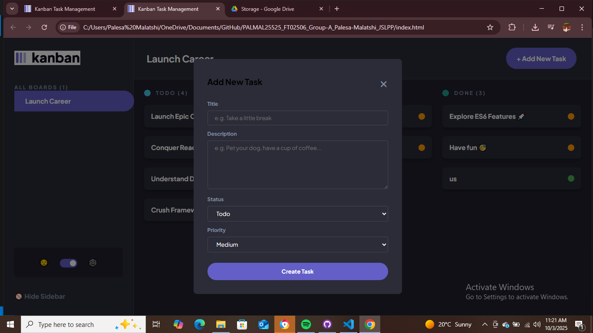

# JSL Portfolio Piece: Kanban Task Management App

A fully responsive Kanban task management web application that allows users to create, read, update, and delete tasks. The application is designed with a mobile-first approach, features a theme switcher for light and dark modes, and persists all data using the browser's local storage after an initial data fetch from a live API.

**Author:** Palesa Malatshi

---

- **Live Deployment Link:** [https://palesamalatshi.github.io/PALMAL25525_FT02506_Group-A_Palesa-Malatshi_JSLPP/]
- **Presentation Video Link:** [https://drive.google.com/file/d/1pbmZVtuSJFd8-t7tKvs7cpSWO_8Vvi2P/view?usp=sharing]


---

## Key Features

- **API Data Fetching:** On first load, tasks are dynamically fetched from the JSL Kanban API. Includes loading and error states for a smooth user experience.
- **Full CRUD Functionality:**
    - **Create:** Add new tasks via an intuitive modal form.
    - **Read:** View all tasks organized in "Todo", "Doing", and "Done" columns.
    - **Update:** Edit any task's title, description, status, and priority in a detailed modal. Changing the status automatically moves the task to the correct column.
    - **Delete:** Remove tasks with a confirmation step to prevent accidental deletion.
- **Data Persistence:** All tasks and their properties are saved to `localStorage`, ensuring your board state is preserved across browser sessions.
- **Responsive Design:** A seamless experience across desktop, tablet, and mobile devices, with UI elements adapting perfectly to different screen sizes.
- **Sidebar Interaction:** A toggleable sidebar on desktop view to maximize screen space, which transforms into a mobile menu accessible from the header.
- **Light/Dark Mode Theme Toggle:** A functional theme switcher to toggle between a light and dark interface, with the user's preference saved locally.
- **(Stretch Goal) Task Priority System:**
    - Assign **High, Medium, or Low** priority to tasks.
    - Priority is visually indicated on each task card for quick identification.
    - Tasks within each column are **automatically sorted** by priority (High priority tasks appear first).

## Technical Stack

- **HTML5:** Semantic and accessible markup.
- **CSS3:** Modern CSS with Flexbox, Grid, and Custom Properties for layout and theming.
- **JavaScript (ES6+ Modules):** Clean, modular, and maintainable code handling all application logic, from API requests to DOM manipulation and state management.

## Setup and Installation

To run this project locally, follow these steps:

1.  Clone the repository:
    ```bash
    git clone [https://github.com/your-username/your-repo-name.git](https://github.com/your-username/your-repo-name.git)
    ```
2.  Navigate to the project directory:
    ```bash
    cd your-repo-name
    ```
3.  Open the `index.html` file in your web browser. No special servers or build steps are required.